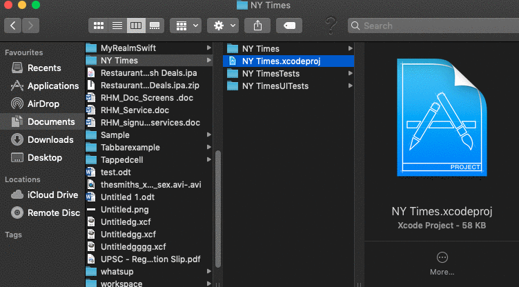

# NYTIMES

> Builded a simple app to hit the NY Times Most Popular Articles API and show a list of articles, that shows details when items
on the list are tapped (a typical master/detail app). 
Used the most viewed section of below this API. 
http://api.nytimes.com/svc/mostpopular/v2/mostviewed/{section}/{period}.json?api- key=sample-key 

EX: http://api.nytimes.com/svc/mostpopular/v2/mostviewed/all-sections/7.json?api- key=sample-key 

Here Sample key i recived from NY times developer account and used above api to fetched the results and created app 

## Requirements

- iOS 9.0+
- Xcode 10.3

## How to build and run the code

- [x] Download and Unzip the file or open with xcode option
- [x] select NY Times folder and Open NY Times.xcodeproj file
- [x] Select any simulator or device 
- [x] Run the build or press cmd+R on your computer keyboard 

## Meta

Ramesh Guddala  – rameshg.iosmobile@gmail.com
